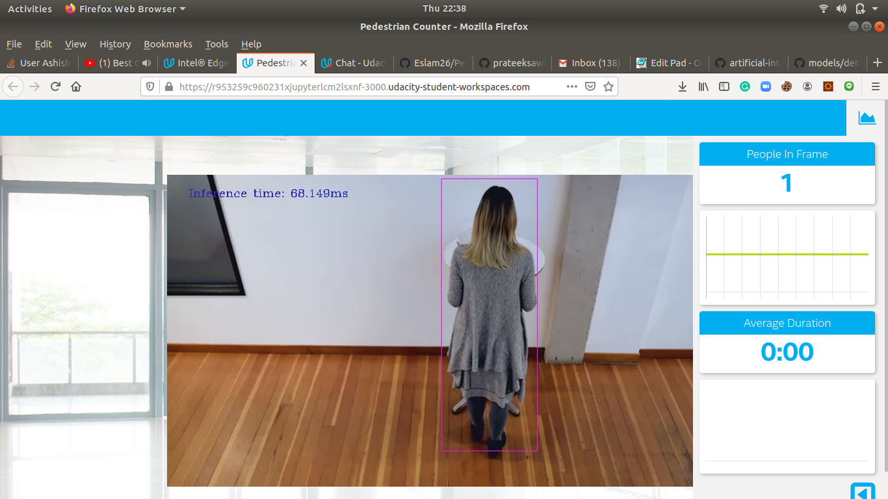
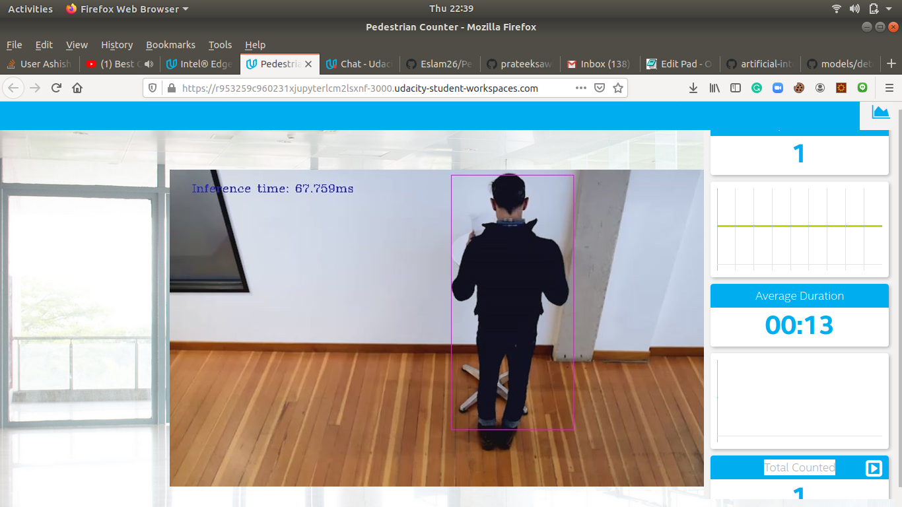
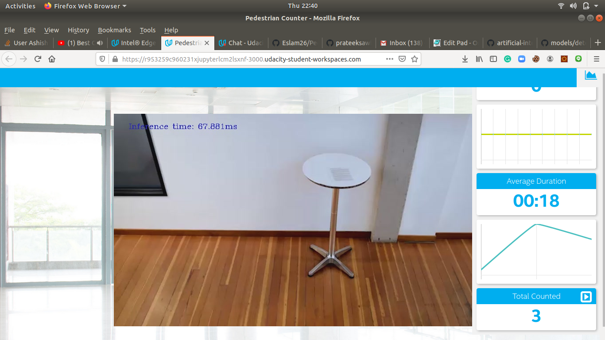

# Project Write-Up

You can use this document as a template for providing your project write-up. However, if you
have a different format you prefer, feel free to use it as long as you answer all required
questions.

## Explaining Custom Layers

Although customs layers are  necessary and important to have feature of the OpenVINO™, they are not used often because of the supported layers.The list of supported layers from before straightforwardly relates to whether a given layer is a custom layer. Any layer not in that list is consequently delegated as a custom layer by the Model Optimizer. To actually add custom layers, there are a few differences depending on the original model framework.The process involved in customs layers are:
1. In Cafee and tensor flow,  register the custom layers as extensions to the Model Optimizer.
2. For Caffe, register the layers as Custom, then use Caffe to calculate the output shape of the layer. There should be caffe on the system for this.
3. For TensorFlow,  Replace the unsupported subgraph with a different subgraph. The final TensorFlow option is to actually offload the computation of the subgraph back to TensorFlow during inference.
4. After that use model Optimizer to generate IR Files Containing the Custom Layer
5. Edit CPU extension Template files
6. Finally execute the model with customs layers.

The main reason for using Custom Layers Include:
1. For handling the unsupported layers custom layers are used.

2. To optimize our pre-trained models and convert them to a IR without losing accuracy and to speed up the work the custom layers are used.

3. OpenVino toolkit utilizes model enhancer to reduce the size of the model. Model optimizer looks for the rundown of known layers for each layer in the model. The inference engine  loads the layers from the model IR into the predefined gadget module, which will look through a rundown of known layer usage for the gadget. In the event that your model architecure contains layer or layers that are not in the rundown of known layers for the device, the Inference Engine believes the layer to be unsupported and reports a mistake. To utilize the model having the unsupported layer we have to utilize the custom layer feature of OpenVino Toolkit


## Model conversion process
### For ssd_mobilenet_v2_coco_2018_03_29

1. First of all i used wget to download the model from the repository via link http://download.tensorflow.org/models/object_detection/ssd_mobilenet_v2_coco_2018_03_29.tar.gz. It is Supported Frozen Topology from TensorFlow Object Detection Models Zoo. after that i unzipped the tar using Tar -xvf command. 
using 
 ```
   tar -xvf ssd_mobilenet_v2_coco_2018_03_29.tar.gz 
   ```

2. After that for converting model to IR I  downloaded SSD MobileNet V2 COCO model's .pb file using the model optimizer using the command.
```
  python /opt/intel/openvino/deployment_tools/model_optimizer/mo.py --input_model model/frozen_inference_graph.pb --tensorflow_object_detection_api_pipeline_config pipeline.config --reverse_input_channels --tensorflow_use_custom_operations_config /opt/intel/openvino/deployment_tools/model_optimizer/extensions/front/tf/ssd_v2_support.json
   ```

3. In above command opt/intel/openvino/deployment_tools/model_optimizer/mo.py path is path to model optimizer file. The next argument input_model frozen_inference_graph.pb is the input model for conversion which is in pb format. next is configuration file . this is pipe line config file. I also reveresed the input channel. At last fed in the json file.the conversion was sucessful, it formed .xml file and .bin file. 

The Generated IR model files are :

XML file: /home/workspace/model/frozen_inference_graph.xml
BIN file: /home/workspace/model/frozen_inference_graph.bin

3. Finally i run the program using command:
for video file: 
```
 python main.py -i resources/Pedestrian_Detect_2_1_1.mp4 -m "/home/workspace/ssd_mobilenet_v2_coco_2018_03_29/frozen_inference_graph.xml" -l /opt/intel/openvino/deployment_tools/inference_engine/lib/intel64/libcpu_extension_sse4.so -d CPU -pt 0.4 | ffmpeg -v warning -f rawvideo -pixel_format bgr24 -video_size 768x432 -framerate 24 -i - http://0.0.0.0:3004/fac.ffm
   ```
   Remember Here I used  probability threshold of **0.4** for better accuracy and result. I got 100% Accuracy.
   
   # For person detection model from Openvino model zoo 

I also converted tensorflow-yolo-v3 model to Inference engine. For that i cloned git repository of yolo v3 model using link https://github.com/mystic123/tensorflow-yolo-v3.git after that downloaded the coco_names and yolov3.weights. And finally run the converter using command
python3 convert_weights_pb.py --class_names coco.names --data_format NHWC --weights_file yolov3.weights
and finally run the model using python main.py -i resources/Pedestrian_Detect_2_1_1.mp4 -m "/home/workspace/tensorflow-yolo-v3/frozen_darknet_yolov3_model.xml" -l /opt/intel/openvino/deployment_tools/inference_engine/lib/intel64/libcpu_extension_sse4.so -d CPU -pt 0.6 | ffmpeg -v warning -f rawvideo -pixel_format bgr24 -video_size 768x432 -framerate 24 -i - http://0.0.0.0:3004/fac.ffm

## Comparing Model Performance
My method(s) to compare models before and after conversion to Intermediate Representations
were :

## SSD_mobilenet_v2_coco 
The size of ssd_mobilenet_v2_coco the model pre- and post-conversion was almost the same. The SSD MobileNet V2 COCO model .pb file is about 66.4 MB and the IR bin file is 64.1 MB. I tried to run adhoc script for predicting a person through pretrained model and calculate d inference time and accuracy before conversion.There are various methods of Accuracy prediction but I used this method of accuracy calculation: Accuracy =
(No. of frames a person is detected with bounding box)/(no. of frames person was present) as suggested by one of the mentor. The inference speed before conversion was 80ms, which is higher than post conversion about 73ms. so the difference in inference time was about 6ms. The model before conversion measured 6 person measured in the given time frame getting about 95 % accuracy. where as after conversion got 100 % accuracy after maintaining the duration threshold.
. From the other research I found It's mean accuracy precision was 21 map. The accuracy was obtained from https://github.com/tensorflow/models/blob/master/research/object_detection/g3doc/detection_model_zoo.md.
|Test|before conversion to IR | after conversion to IR|Difference|
|-------------- | ------------- |-------------|---------|
|Inference time|80 ms|73ms|7ms|
|Size of Model|66.4 MB|64.1 MB|2.3 MB|
|Accuracy|95%|100%|5%|

## Pretrained person detection Model
I also  tested pretrained model from open zoo and found that pretained model has less inference time than the open source model. The pretrained model i used was person-detection-retail-0013 model. It had inference time of 43ms only. It had better accuracy than the previous. The size of the model file was only 2.59 mb. It has accuracy of 21 Map.

|Test|Test Values|
|-------------- | ------------- |
|Inference time|43 ms|
|Size of Model|2.59 MB|
|Accuracy|100%|

## tensorflow_yolo_v3
The size of yolo_v3 after conversion was heavier than earlier one. The Size of frozen_darknet_yolo.pb was 237 mb and size of frozen_darknet_yolo.bin was 236 mb. After the conversion, the inference time was fluctuating heavily. But the average time was 1095 ms most of the times. the map was 33 map. This model didnot detected person nicely. This model performance was weak compared to precious one.


--------------------------------------------------------------------------------------------------------------------------------------
After analyzing these models we get that the SSD model and the person detection model from the open vino had al,ost same accuracy. But the tensorflow_yolo_v3 model did not worked properly. Based on the accuracy of the model used to detect people, this app's performance can varry. Edge devices are supposed to work almost instantly.The inference spped was also higher after the conversion. The size of the model was reduced after conversion of model to IR. 

## Assess Model Use Cases

Some of the potential use cases of the people counter app are:

-At the shops to keep the track of cutomers by their interest, and at the traffic signal to make sure that people crosses safely.

-Monitor passenger traffic flow in air port and train station and Assign staff deployment based on demand. 

-It is also very useful in queue management. 


## Assess Effects on End User Needs

Lighting, model accuracy, and camera focal length/image size have different effects on a deployed edge model. The potential effects of each of these are as follows:

-In day light the quality is not affected but in the night light and dim light the performance is affected. In Night the light is dim so the low lighting can cause edges to be missed and thus miss detecting people in the frame

-Camera angle also highly affects the accuracy. The model did not detected properly when the camera angle was changed the changed camera angle misses the property of the object so the object is not detected properly.

-The image size should also be in proporational with the model accuracy. Otherwise the detection confusion matrix will be highly affected. There will be more false negatives.

  
  Below is the screenshot which will show the runnning condition of the application.
  
  \
  \
  \
  \
  


  
  
